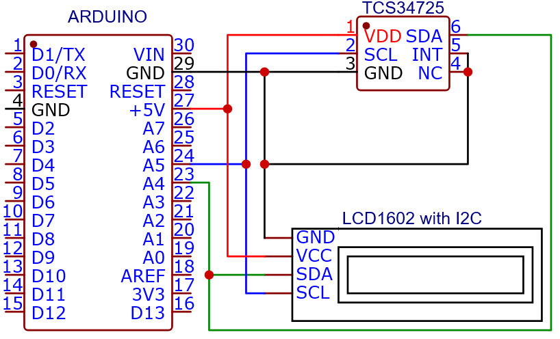

# Arduino_sketch_for_I2C_TCS34725_LCD1602

В данном репозитории находится программный код проекта для Arduino Uno R3, соединенного с датчиком цвета TCS34725 и жидкокристаллическим дисплеем LCD 1602.

Сборка:

* Arduino UNO R3;

* Adafruit TCS34725;

* LCD1602 ;

* Преобразователь I2C.

## Схема соединений:

## Настройка кода:

### 1. Период опроса датчика цвета в миллисекундах (в коде строка №7). 

> Возможные варианты: 

> 24MS 

> 101MS 

> 154MS 

> 614MS 

> 700MS

### 2. Расположение отображаемых на дисплее цифр (в коде строки №28-39).

Например:

lcd.setCursor(0, 0);    //<- Установка курсора на 1 символ 1 строки

lcd.setCursor(2, 0);    //<- Установка курсора на 3 символ 1 строки

lcd.setCursor(9, 1);    //<- Установка курсора на 1 символ 2 строки

lcd.setCursor(9, 1);    //<- Установка курсора на 10 символ 2 строки

## Библиотеки для работы:

Wire.h

LiquidCrystal_I2C.h

Adafruit_TCS34725.h